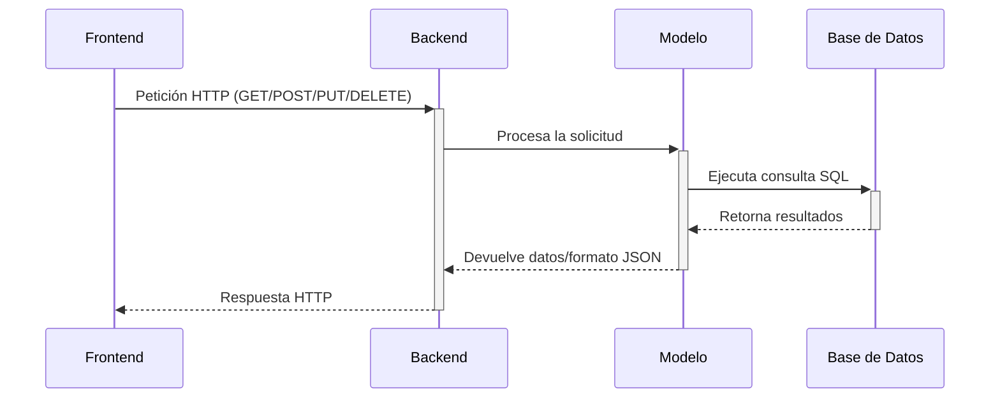
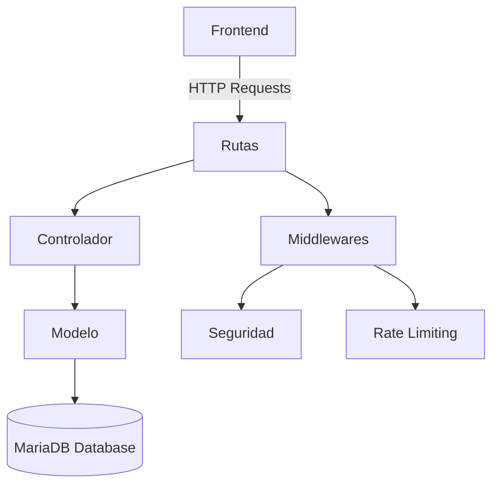

# **📂 BackEnd - Sistema de Gestión de Libros**  

## **🚀 Tecnologías Principales**
- **Entorno**: Node.js v18+
- **Base de Datos**: MariaDB (compatible con MySQL)
- **Formato de Datos**: JSON para API REST
- **Framework**: Express.js

## **📌 Estructura del Proyecto**
```bash
📁 BackEnd/
├── 📁 node_modules/      # Dependencias instaladas
├── 📁 src/               # Código fuente principal
├── 📄 .env               # Variables de entorno
├── 📄 app.js             # Punto de entrada del servidor
├── 📄 package.json       # Configuración de proyecto y dependencias
├── 📄 package-lock.json  # Versiones exactas de dependencias
└── 📄 README.md          # Este archivo

```

## **🔧 Configuración Inicial**
1. Instalar dependencias:
```bash
npm install express mariadb dotenv cors

```
Configurar .env:

**📡 Endpoints API**
```bash
// Ejemplo de ruta en routes/books.js
router.get('/', bookController.getBooks);       // GET /api/books
router.post('/', bookController.createBook);    // POST /api/books
```
**🗃️ Conexión a MariaDB**
```bash
// En models/db.js
const mariadb = require('mariadb');
const pool = mariadb.createPool({
  host: process.env.DB_HOST,
  user: process.env.DB_USER,
  password: process.env.DB_PASSWORD,
  database: process.env.DB_NAME
});
```
**⚠️ Solución de Problemas Comunes**
1. Error de conexión:

  Verificar credenciales en .env

  Asegurar que MariaDB esté en ejecución

2. Dependencias faltantes:
```bash
npm install
```
---
**🔗 Integración con FrontEnd**
```bash
// En tu frontend (admin.js)
fetch('http://localhost:3000/api/books')
  .then(response => response.json())
  .then(data => console.log(data));
```
---

# Flujo de la Aplicación

## Frontend (`admin.html`/`admin.js`)

### Interfaz de Usuario
- Formulario para agregar/editar libros
- Lista dinámica de libros existentes

### Eventos Principales
- `fetchBooks()`: Carga inicial de libros desde el backend
- Submit del formulario: Envía datos al backend (POST/PUT)
- Botones "Editar/Eliminar": Disparan acciones específicas

## Backend (API REST)


---

```markdown
# Componentes Clave del Sistema

## A. Base de Datos (MySQL)
**Tabla `libro`**:
- Campos principales: `Titulo`, `Autor`, `Precio`, etc.
- Relaciones:
  - `COMPRA_idCOMPRA` (para sistema de compras futuro)
  - `COMPRA_USUARIO_correo` (relación con usuarios)

## B. Modelo (`models/book.js`)
```javascript
// Ejemplo de estructura
class BookModel {
  // CRUD con transacciones SQL
  static async createBook(bookData) {
    // Validaciones y atomicidad
  }
  
  // Manejo de errores específicos
  static async getById(id) {
    // Diferenciar 404 vs 500
  }
}
```

## C. Controlador (`controllers/bookcontroller.js`)
| Método        | Función                          | Códigos HTTP |
|---------------|----------------------------------|--------------|
| `getBooks`    | Obtiene todos los libros         | 200, 500     |
| `createBook`  | Valida y crea nuevo libro        | 201, 400, 500|
| `updateBook`  | Verifica existencia y actualiza  | 200, 404, 500|
| `deleteBook`  | Elimina con validación previa    | 204, 404, 500|

## D. Rutas (`routes/books.js`)
```javascript
// Endpoints RESTful
router.get('/api/books', bookController.getBooks);
router.get('/api/books/:id', bookController.getBookById);
router.post('/api/books', bookController.createBook);
router.put('/api/books/:id', bookController.updateBook);
router.delete('/api/books/:id', bookController.deleteBook);
```

## E. Servidor (`app.js`)
**Middlewares esenciales**:
```javascript
app.use(helmet()); // Seguridad básica (XSS, etc.)
app.use(rateLimit({ // Limitación de peticiones
  windowMs: 15 * 60 * 1000, // 15 minutos
  max: 100 // Límite por IP
}));
app.use(cors()); // Configuración CORS
app.use(express.json({ limit: '10kb' })); // Parseo de JSON
```
---
# Arquitectura del Sistemas

