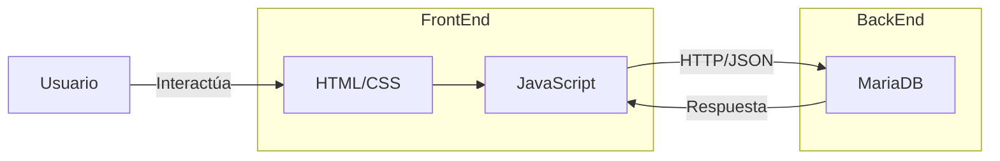
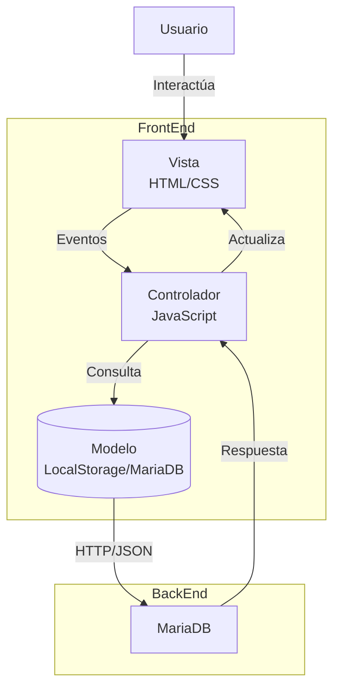

# 📚 SCDBooks - Librería Digital  

**Integrantes:**  
- **David Fernando Rojas Vasquez** (Master/Desarrollador)  
- **Carlos Eduardo Contreras López** (Tester/Desarrollador)  
- **Juan Sebastian Gonzalez Arcos** (Tester/Desarrollador)  

---

## 🔧 Arquitectura  
**Frontend**: HTML5, CSS3, JavaScript (ES6+)  
**Backend**: Node.js + Express + MariaDB (MySQL Workbench)  
**Autenticación**: JWT  
**Persistencia**: Base de datos relacional (MariaDB)  

---

## 🛠 Tecnologías  
| **Frontend**       | **Backend**               | **Base de Datos**    |  
|--------------------|--------------------------|----------------------|  
|               | Node.js                  |               |  
|          | Express.js               |       |  
|   | JWT (Autenticación)      |                   |  

---


---
# 📂 Estructura del Proyecto

```bash
.
├── 📁 BackEnd/
│   ├── 📁 Documentation/      # Documentación técnica
│   │   └── 📄 README.md.txt   # Guía de configuración
│   └── 📁 BasDat/
│       └── 🔒 libreriadb.sql.gpg  # Script SQL encriptado
│
├── 📁 FrontEnd/
│   ├── 📁 img/                # Assets visuales
│   ├── 🌐 buscador.html       # Interfaz de búsqueda
│   ├── 🌐 comprar.html        # Página de compras
│   ├── 🌐 contactanos.html    # Formulario de contacto
│   ├── 🌐 detalle-libro.html  # Vista detallada
│   ├── 🌐 index.html          # Página principal
│   ├── 🎨 globals.css         # Estilos globales
│   ├── 🎨 style.css          # Estilos principales
│   ├── 🎨 styleguide.css     # Guía de diseño
│   ├── ⚙️ buscador.js        # Lógica de búsqueda
│   └── ⚙️ script.js          # Funcionalidad core
│
└── 📁 Documentation/          # Documentación general
Documentation/ # Documentación


```

## 🏗️ Arquitectura del Sistema

### 🔷 Modelo Cliente-Servidor



## 🏗️ Arquitectura Híbrida (Cliente-Servidor + MVC)


- 🎯 **MVC (Modelo-Vista-Controlador)**
  - Modelo: `libreriadb.sql` (Estructuras SQL)
  - Vista: `*.html` + `*.css` (Renderizado)
  - Controlador: `*.js` (Gestión de eventos)
    
- 🔗 **Singleton** 
  - Conexión única a la base de datos
  - Ejemplo: `dbConnection.js` (Si se usa Node.js)

- 🔄 **Observer**
  - Notificaciones en tiempo real (Ej: actualización de carrito)
